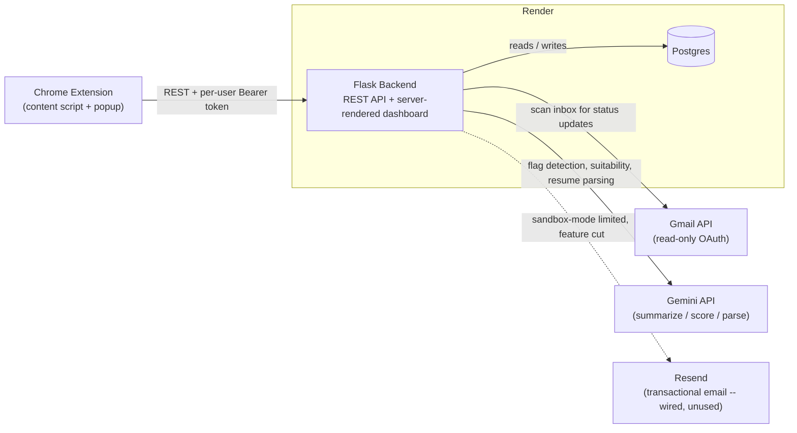
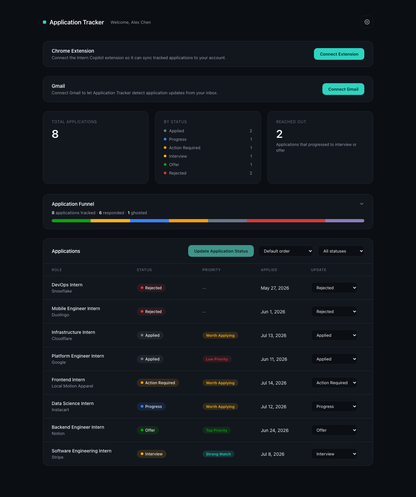
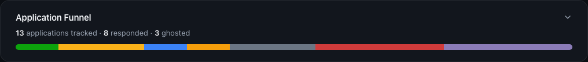
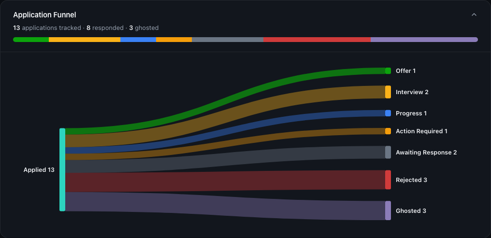
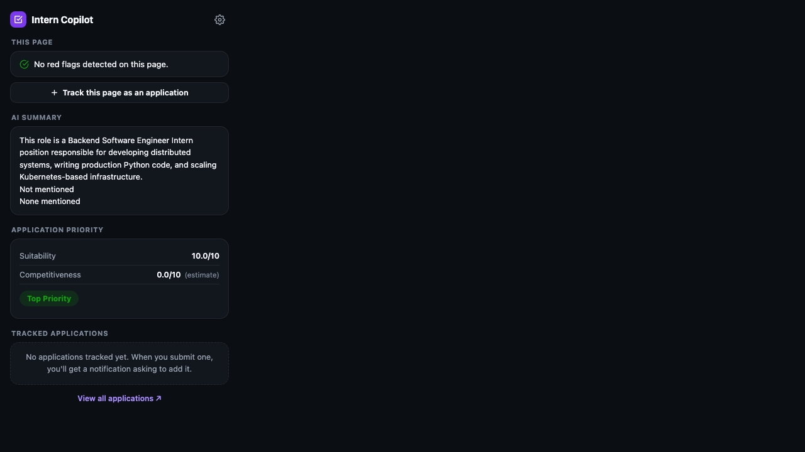

# Application Tracker

[](https://github.com/razeen06/application-tracker/actions/workflows/ci.yml)

Application Tracker is a job/internship application tracker built around a Chrome extension and a Flask backend. The extension detects job postings as you browse, flags eligibility red flags (unpaid roles, GPA cutoffs, visa restrictions) before you apply, and tracks what you've applied to. The backend scans a connected Gmail inbox to suggest status updates from real recruiter emails, scores each tracked application on how well it suits you and how competitive the company is, and visualizes the whole pipeline — including the applications that never got a response.

## Architecture



The extension never talks to Gmail or Gemini directly — it only ever calls the Flask API with a bearer token, and the API is the only thing that holds real credentials (Gmail refresh tokens, encrypted at rest; the Gemini key; Postgres credentials). The dashboard is server-rendered Jinja2 with vanilla JS, not a separate frontend app, so there's one deployable unit on Render.

## Features

- **Automatic job detection** — a content script recognizes postings on major boards (LinkedIn, Indeed, Greenhouse, Lever, SmartRecruiters, Workday) plus a URL/text heuristic for arbitrary company career pages, and offers to track them.
- **AI red-flag summarization** — one Gemini call per posting returns a 3-bullet summary and a red-flag analysis (unpaid role, WAM/GPA cutoff, penultimate/final-year requirement, citizenship/visa restriction). The flags are AI-reasoned against the whole posting, not keyword-matched — see [the "unpaid leave" story](#ai-first-flag-detection-after-a-false-positive-on-a-paid-role) below for why that distinction mattered in practice.
- **Gmail-based status suggestions** — an optional read-only Gmail connection scans for messages matching tracked applications and classifies each one (Interview Offered / Action Required / Progress / Rejected / Closed / Not Relevant) via Gemini. Closed is reserved for a filled/cancelled role or ended hiring period; Rejected still means the candidate was explicitly not selected. Nothing is applied automatically; a suggestion sits as a banner on the dashboard until accepted or overridden by a manual status change.
- **Application Priority scoring** — a single label per application, built from three genuinely different kinds of signal that are kept deliberately separate rather than all being "the AI's opinion":
  - **Suitability** *(AI)* — how well the candidate's resume/background matches this specific posting.
  - **Competitiveness** *(AI)* — how selective the company generally is to get into, preferring a real Google Search–grounded Gemini call when the API key's quota allows it, and falling back to an explicitly-labeled model estimate when it doesn't (cached per company for 30 days either way).
  - **Historical response rate** *(deterministic — no AI)* — computed by a plain SQL aggregation over the user's own past applications, bucketed by comparable competitiveness score. This number is never guessed by a model; it's a straight count of how often that bucket of past applications ever heard back at all.

  The three combine through a fixed weighted formula into one of four labels (Low Priority → Worth Applying → Strong Match → Top Priority), shown on the dashboard with sort support and in the extension popup as each score resolves.
- **Application Funnel** — a Sankey diagram of how tracked applications resolve: Interview, Offer, Rejected, Closed, Action Required, Progress, or the combined unresolved **Ghosted / Awaiting Response** bucket. The extension and Gmail discovery flows capture a reliable role-start/hiring-end date when one is explicitly stated (never the application submission deadline); an otherwise-unresolved application moves into the derived Closed funnel outcome after that date passes. The derived outcome is computed fresh rather than rewriting the user's stored status. Collapses to a compact summary bar by default; click to expand into the full diagram.
- **Resume parsing** — upload a PDF or DOCX resume and it's parsed by Gemini into structured skills, education, work experience, and stated interests, which becomes the primary input to suitability scoring (the free-text background field becomes an optional supplement for anything a resume doesn't capture, like remote-only preferences).

## Interesting problems solved

### The migration that would pass locally and break in production

Local development and tests run on SQLite; production runs on Postgres. That split caused two distinct, real failures before a CI job was added to catch them:

1. **Postgres backs `db.Enum` with a real native `ENUM` type; SQLite has none** — `status` is just an unconstrained `VARCHAR` there. Adding two new statuses (`ACTION_REQUIRED`, `PROGRESS`) needed an explicit `ALTER TYPE ... ADD VALUE` on Postgres, which can't even run inside the transaction Alembic normally wraps a migration in — it needs its own autocommit block. A migration that applied cleanly against SQLite could still fail against the real production database.
2. **A `flask` CLI quirk broke `flask db upgrade` specifically in the Render deploy step.** `FLASK_DEBUG=true` survives fine through direct invocations (gunicorn, `python app.py`) but the `flask` CLI's own argument parsing rewrites it to `"1"` before the app ever reads it — which tripped a `FLASK_SECRET_KEY must be set` guard, but only when the CLI itself was the entry point. No local test fixture used the CLI path, so this was invisible until it hit the actual deploy command.

Neither was caught until a second GitHub Actions job was added that applies the *entire* migration chain, in order, against a genuinely fresh Postgres database on every push — not SQLite, not an already-migrated database. It caught the `FLASK_DEBUG` bug on its first real run.

### Resend's sandbox mode and the feature that got cut before it shipped

Email/password login was built with verification codes and password-reset emails going out through Resend. Resend's free tier only delivers to the account's *own* verified email address until a custom sending domain is verified — a standard anti-spam sandbox restriction, but one that means a code addressed to an actual end user's arbitrary inbox would silently never arrive. With no verified domain in place, the feature would have worked perfectly in local testing (sending to the developer's own address) and been completely broken for every other user. Verification and reset were cut before any of it reached production — plain email/password login shipped without them, and `email_client.py`/Resend stayed wired up but dormant, ready to turn back on once a real sending domain exists.

### AI-first flag detection, after a false-positive on a paid role

The original red-flag detector was pure regex: any posting containing the word "unpaid" got flagged as an unpaid internship. A real posting listed a genuine `$32/hour` salary but also mentioned an unrelated "unpaid leave" policy elsewhere in its boilerplate — and got incorrectly flagged anyway, since the regex had no notion of context. The fix folded flag detection into the same Gemini call that already generates the page summary (no added API cost), asking the model to reason about whether the role is *actually* unpaid rather than pattern-match a keyword. Verified against a live call: the same posting now correctly returns no flags, and a genuinely unpaid posting is still caught.

### Gemini's search grounding, and designing around a quota you can't control

Competitiveness scoring was meant to use Gemini's Google Search grounding so a company's score reflects real, current information instead of the model's training data. In practice, the configured API key hits a `429 RESOURCE_EXHAUSTED` specific to the search-grounding tool, even though plain (ungrounded) calls on the same key work fine — a quota restriction outside the app's control, discovered by actually making the grounded call rather than assuming the SDK version supported it. The fix isn't a static "grounding is unsupported" branch: every competitiveness call tries the grounded request first and falls back to a plain prompt only if that fails, so it self-adapts to whatever a given key's tier allows. What matters more: the `grounded` flag returned to the client reflects what *actually happened* on that call, not what was attempted — so an ungrounded estimate is always labeled as an estimate in the UI, never presented as verified research it isn't.

### An intermittent 500 on login that only showed up in production

Users occasionally hit a bare Internal Server Error on login, with no clear pattern across browsers or requests. The cause was a stale pooled Postgres connection: Render's managed Postgres silently drops idle connections, and without `pool_pre_ping` enabled, SQLAlchemy would occasionally hand out a connection the database had already closed, surfacing as an uncaught `OperationalError` instead of a transparent reconnect. Enabling `pool_pre_ping` makes SQLAlchemy test a pooled connection before handing it out and silently reconnect if it's gone stale — the kind of bug that's very hard to reproduce locally against a long-lived SQLite file, since there's no connection pool to go stale in the first place.

## Tech stack

**Backend**
- Flask 3, Flask-SQLAlchemy, Flask-Migrate (Alembic) for schema migrations
- Postgres 17 in production (Render managed database), SQLite for local dev/tests
- Authlib for Google OAuth; Werkzeug for password hashing
- `google-genai` SDK against `gemini-3.1-flash-lite`, used for page summarization/flags, email classification, suitability + competitiveness scoring, and resume parsing
- Gmail API (read-only scope) for scanning a connected inbox
- `python-docx` for DOCX text extraction — PDFs are sent to Gemini directly as multimodal input, no PDF library needed
- `cryptography` (Fernet) to encrypt stored Gmail refresh tokens at rest
- Sentry for production error tracking; Resend for transactional email (wired, currently dormant — see above)
- Gunicorn, deployed on Render

**Extension**
- Manifest V3: a content script for page scraping/flag pre-filtering, a background service worker as the single point of contact with the API, and a popup UI — all vanilla JS, no framework or build step

**Dashboard**
- Server-rendered Jinja2 + vanilla JS, no separate frontend build
- D3.js + d3-sankey, loaded from a CDN only when the funnel diagram is expanded (~95KB gzipped combined — picked after actually measuring it against Plotly's ~1.3MB minimal bundle for the same job)

**Testing & CI**
- pytest + pytest-playwright for Postgres-backed integration tests and real-browser flows
- GitHub Actions: a Postgres-backed test suite job, and a separate job that applies the full migration chain against a from-scratch Postgres database on every push

## Screenshots

**Dashboard** — stats, the Application Funnel preview, and tracked applications with Priority scoring and sorting:



**Application Funnel** — collapsed summary bar, and expanded into the full Sankey diagram:





**Extension popup** — red-flag detection, AI summary, and Application Priority scores as they resolve:



## Development

```
pip install -r requirements-dev.txt
playwright install chromium
cp .env.example .env   # fill in at least FLASK_SECRET_KEY; see comments for what each optional key unlocks
flask --app app db upgrade
python app.py
```

Tests run against a throwaway SQLite database locally by default. Set `DATABASE_URL` to point them at Postgres instead (this is what CI does, since the app's `status` column behaves differently as a native Postgres enum vs. SQLite's untyped `VARCHAR` — see [Interesting problems solved](#interesting-problems-solved)):

```
pytest tests/
```

Most functionality degrades gracefully without every key set — `GEMINI_API_KEY` gates AI summaries/scoring/resume parsing, `GOOGLE_CLIENT_ID`/`GOOGLE_CLIENT_SECRET` gate Google sign-in, `GMAIL_TOKEN_ENCRYPTION_KEY` gates Gmail connection, and `SENTRY_DSN` is production-only. See `.env.example` for what each variable does and where to get it.

The companion [Application Tracker Chrome extension](https://github.com/razeen06/application-tracker-extension) is a separate repo; load it unpacked via `chrome://extensions` for local testing against this backend.

## CI

`.github/workflows/ci.yml` runs on every push and pull request to `main`:

- **test** — the full pytest suite (including Playwright browser tests) against a real Postgres service container.
- **migrations** — applies every Alembic migration in order against a fresh, empty Postgres database, the same way a brand-new production database would see them. This is what catches migration-chain breakage before it reaches Render, rather than after.

CI is verification only — it does not deploy. Render deploys from `main` on its own, independent of this workflow's outcome.

## Error tracking

Unhandled exceptions in production are reported to [Sentry](https://sentry.io) automatically — set `SENTRY_DSN` and they show up in the Sentry dashboard as they happen, instead of only being caught when a user reports something or someone happens to query the database. Local dev and test runs never report anywhere: `SENTRY_DSN` unset skips Sentry setup entirely (see `app.py`'s `create_app()`), and the test suite explicitly blanks it out even if a local `.env` has one, so routine `pytest` runs don't send noise to the real project.
